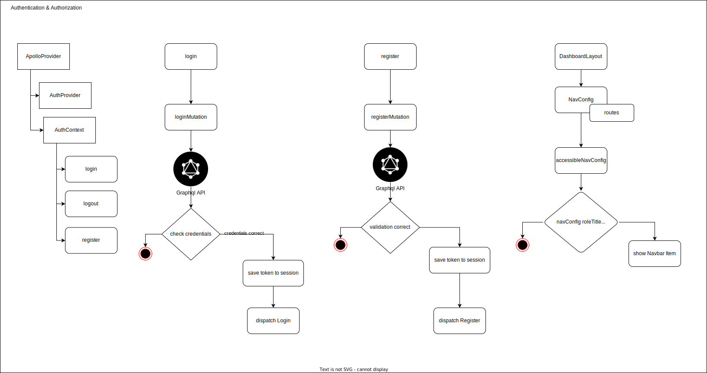

## Intro

For Affiliate Marketers one of the hardest parts is to find good Products, there is a lot to
consider. The promoted product must fit the target group. The product should be relevant to
the niche of the marketer's content. It is important that the product has a good quality and
doesn’t have a bad reputation. The commission and revenue model should be fair to ensure
that it is possible to earn more than the marketing costs for ads for example.
It is essential to do a competitor analysis to get to know which products have less
competition. to increase the chance of commissions. Demands and trends are also essential
to consider in the product-finding process. The product should have a good sales page and
should have vendor support for affiliate marketers.

Affililab is a Web Platform that recommends Affiliate Marketers Partner programs with good values,
matching their preferences, and getting recommendations by similar Users.
Users are able to notice partner programs, compare them, and search for partner programs.
Find Learning Resources and tools, and combine them into Campaigns. Also here the user gets recommendations for products
fitting to products in a Campaign.

The Website https://affililab.de can be visited here **[here](https://affililab.de)**

# Technical Structure of the Project

**[All Draw IO Diagrams](./assets/application-structure.drawio)**

- [Technical Structure of the Project](#technical-structure-of-the-project)
    * [Application Overview](#application-overview)
        + [Project Entities](#project-entities)
    * [Frontend](#frontend)
        + [used frameworks & Libraries](#used-frameworks--libraries)

    + [Redux implementation](#redux-implementation)
    + [Usage of Provider Pattern](#usage-of-provider-pattern)
    + [Apollo Graphql Client](#apollo-graphql-client)
    + [Layouts Components Main Page and Dashboard](#layouts-components-main-page-and-dashboard)
    + [Frontend Authentication](#frontend-authentication)
    + [Module Structure](#module-structure)
        * [Backend](#backend)
    + [Request Flow](#request-flow)
    + [Authentication Structure](#authentication-structure)
    + [Backend Authorization](#backend-authorization)
        * [Database Structure](#database-structure)
            + [ERM](#erm)
        * [Crawler](#crawler)
            + [indexing](#indexing)
            + [crawling](#crawling)
            + [importer](#importer)
        * [Recommendation Service](#recommendation-service)
- [!recommendation-approaches.svg](#recommendation-approachessvg)
    * [Integration of the Recommendation System into the Project Structure](#integration-of-the-recommendation-system-into-the-project-structure)
- [!recommendation-overview.svg](#recommendation-overviewsvg)
    * [Content Based](#content-based)
- [!cosin-similarity-search.png](#cosin-similarity-searchpng)
    + [Algorithm Flow Chart](#algorithm-flow-chart)
        * [Collaborative](#collaborative)
            + [Algorithm Flow Chart](#algorithm-flow-chart-1)
        * [Security Measurements](#security-measurements)
            + [Thread Model](#thread-model)
        * [Application Security](#application-security)
            + [Threats](#threats)

## Application Overview

[Application Views](./Application.md)
# [](./assets/images/application-structure/application-structure.svg)

### Project Entities

1. [Frontend Application](https://github.com/affililab/affililab-vite-frontend) - written in ReactJs Typescript
2. [Frontend Library](https://github.com/affililab/app-library) - written in Typescript
3. [Backend](https://github.com/affililab/affililab-backend) (Backend of Application) - written in Typescript
4. [Backend Library](https://github.com/affililab/affililab-ms-library) - written in Typescript
5. Crawler for partnerprograms - written in Typescript
    - [100partnerprogramme-crawler](https://github.com/affililab/hunder_partnerprograms-crawler)
6. [Recommendation System](https://github.com/affililab/recommendation-system) - written in Python

## Frontend

The Frontend is built in React with Vite as build Tool, it performs bundling as part of the build process which is a
different approach to traditional bundlers like Webpack. It's devided in the actual application and a library with all
Base Functionality, Layouts , Providers for Theming, Redux, ... . The Frontend includes A Partnerprogram Listing,
Authentication, Authorization, Notice Partnerprograms, Listing Tools, Learning Resources Partnerprograms. Creating Saved
Filters, Notice PartnerPrograms. Dashboard, Partnerprogram recommendations, Product Finder Wizard, Admin Panel and Intro
Modals

### used frameworks & Libraries

- React
- Apollo (GraphQl Client)
- redux (manage global state)
- mui (Material UI as Design System, Component Library)
- casl (Authorization)

# [](./assets/images/application-structure-frontend-application-structure.drawio.svg)

### Redux implementation

Usage of Redux for global state used in

- auth state
- firstWizardModal (with persist, show Intro)
- noticedPartnerPrograms (with persist)
- profileSetup
- welcome modal
- payment

# [](./assets/images/redux-documentation/application-structure-frontend-redux-documentation.drawio.svg)

### Usage of Provider Pattern

Provider Pattern add scope where state can be accessed from child components through context hook used in Drawer
Extended, Redux, ApolloClient.

# [](./assets/images/redux-documentation/application-structure-frontend-context-provider-documentation.drawio.svg)

### Apollo Graphql Client

Usage of Apollo Graphql to connect with backend, using schemas, mutations, implementation of refetch queries to refetch
registered queries in Provider to refetch and update UI based on the JSX logic depending on response data

# [](./assets/images/redux-documentation/application-structure-frontend-apollo-graphql-documentation.drawio.svg)

### Layouts Components Main Page and Dashboard

- Header Items Provider here used to control search items, AccountPopOver or other components displayed in Header
  Component

# [](./assets/images/frontend-layouts.svg)

### Frontend Authentication

# [](./assets/images/frontend-authentication-authorization.svg)

### Module Structure

To create a new Resource Module Base some steps are required

- Register Route, register Module in the /routes/index.tsx

```typescript jsx
import MyNewModule from "../modules/MyNewModule";

export const routes = [
    {
        element: <>
            <Modals/>
            <Outlet/>
        </>,
        children: [
            {
                path: "/app",
                element: <AuthGuard>
                    <DashboardLayout rightElements={[<RightElements key={2}/>]} paths={PATH_APP} navConfig={navConfig}
                                     menuOptions={MENU_OPTIONS}/>
                </AuthGuard>,
                children: [
                    MyNewModule
                ]
            }
        ]
    }
];
```

- Creating the Module route config

```typescript jsx
// modules/MyNewModule/index.tsx
export const MyNewModule = {
    path: "module",
    children: [{
        path: "mynew",
        element: <ManageTable/>
    }]
};
```

- Create a Page

```typescript jsx
// modules/MyNewModule/pages/ManageTable/index.tsx
import {Page} from "my-lib";
import {ManageTable} from "@resources/MyNewResource/components/ManageTable";

export default () => {
    return <Page title="User">
        <ManageTable/>
    </Page>
}
```

- create resource, a resource describes an entity and contains related components, config for admin panel form and table
  generation
- create manage table

```typescript jsx
// resources/MyNewResource/components/ManageTable/index.tsx
import {ManageTable as CommonManageTable} from "@components/ManageTable"
import {resourceSchema} from "@resources/MyNewResource/configs/resourceSchema"
import {useData} from "@resources/MyNewResource/hooks/useData";
import React, {useContext, useEffect} from "react";
import {HeaderItemsContext, SearchInput} from "my-lib";

export const ManageTable = () => {
    const resourceData = useData();

    const {setCenterItems} = useContext(HeaderItemsContext);

    useEffect(() => {
        setCenterItems([<SearchInput placeholder={"Search for My New Resources ..."}
                                     searchValue={resourceData.searchValue} updateInput={resourceData.setSearchValue}
                                     key={1}/>]);
    }, []);

    return <>
        <CommonManageTable resourceName={"MyNewResource"} resourceData={resourceData}
                           resourceSchema={resourceSchema()}/>
    </>;
}
```

- create resourceSchema

```typescript
// resources/MyNewResource/configs/resourceSchema.ts
import {Yup} from "my-lib";

// example for entity with just a title, it contains form configuration for create and update form as well as table configuration,
// form and table gets generated by ManageTable Component and EditCreateModal in src/components by mapping the formfields by config with FormFieldMapper,
// TableCellMapper in case of Tables

export const resourceSchema = () => [
    {
        key: "title",
        formConfig: {
            fieldConfig: {
                label: "Title"
            },
            type: "textField",
            defaultValue: '',
            validation: Yup.string().required('Title is required'),
        },
        showInTable: true,
        tableConfig: {
            type: "text",
            label: "Title",
            cellConfig: {
                alignRight: false
            }
        }
    }
];
```

- Last step registering into NavConfig

```typescript
    // routes/paths.tsx

// add myNewResource
myNewResource: paths(ROOTS_SUPPORT, '/myNewResource'),

// routes/NavConfig.tsx

// register ICON
const ICONS = {
    ...existingIcons,
    myNewResource: getIcon('bx:category')
}

// register in NavConfig
items: [
    ...existing,
    {
        title: 'mynewresource', path: PATH_APP.support.myNewResource, icon: ICONS.myNewResource
    }
]
```

Finally a managed table will exists as admin, contributor role like in the following example, with create / read /
update / delete functionality

# 


## Backend

The Backend is build in Typescript with Apollo Express Webserver and divided in the actual application and a Library
containing base functionality like

- Upload Handling
- Authentication
- Sanitzing input
- Rate Limiting
- initializing of the webserver
  It uses Dependency Injections for Project Dependencies usage of Single Responsible Principe, Layered Architecture
  dividing Data Layer, Presentation Layer, Frameworks Layer for Database Connection init Webserver, Services for using
  3rdParty APIs and so on ... .
- Casl is used for building Athorization Abilities.
- Authentication with jwt token encrypted with Argon2
- Redis Server for Ratelimiting
- MongoDB Database
- Graphql as API
- Google Cloud Storage for file storage
- Shape to resize and minimize Imagesizes on upload

# 

To init an application with initApolloServer the Project Dependencies are getting initialized, the Schema hast to get
prepared and the Authorization Data as Parameter for initApolloServer.
The authorizationInitiator includes rolePermissions with abilities composed of actions and subject. Described further in
Authenctication & Authorization Section.
The Graphql Schemas have to get initialized and as schema Initiator as param of initApolloServer.
The Schema Builder contains the merged typeDefs and resolvers composed of Projects Query and Mutations, with
DependencyInjection Pattern,
the SchemaBuilder gets injected the Project depencies containing, AuthorizationService, DatabaseService, ... as you can
see in the Diagram.

# 

### Request Flow

The following Diagram shows the Request Flow of the Backend.


### Authentication Structure

Here the Authentication Structure in Backend is Described. In the first Flowchart, the context of the ApolloServer is
getting initialized to get access to authenticated User in the Controller Layer.
The the second Flowchart describes the Login flow by using Argon2 hashing algorithm and signing the jwt Token.


### Backend Authorization

Here the Authorization Handling is described, what the Authorization Data contains such as actions and subjects and how
the abilityMiddleware checks if the user has the requested ability or not.
Which ability a user need for the specific query or mutation can be defined before executing the controller
functionality.


## Database Structure

### ERM

The Entity Relationship Model for the MongoDB Database

# [](./assets/images/erm/erm.svg)

## Crawler

To get the Partnerprograms Data a technique called Webscraping or Crawling is used here, where a Headless Browser (
depends on config) starts and the HTML can be requested or actions on the site can be executed.
The Crawler Service is divided in Indexing, Crawling and importer.

### indexing

The Indexing part is to get all urls, create the categories and category groups.
It stores a list of Urls along with a lastCrawled timestamp which is null at this point.

### crawling

Now the Crawling part can start, it goes through all the Urls and scrape the required Data and stores them into a
collection in the MondoDB.

### importer

The Importer reads the items and relationships from Source Database, then reads the target Database and gets the Ids of
the relationships when items already exists (if not it creates) there and defines mapper for it.
In the end it modifies the item data with the mapped relationship Ids and stores it into the target Database


## Recommendation Service

The Recommendation System is a Standalone webserver which gets requested by Backend is not accessible outside from
Server.
It has a Flask Rest API to get recommendation requests for users, by preferences and for campaigns with used
categories, ... .
It contains an Collaborative Approach, Collaborative Filtering and Content Based Filtering. It works as the following
Diagram shows.
The first one recommends by checking for users interacted by other users and checks which programs they also interacts
with and recommends them to User 2.
In Content Based Filtering it checks the content of selected preferences and recommends based on that, it could also use
previous interacted partnerprograms and recommend similar. In this case the preselected Categories and other preferences
are used to work with Content Based Filtering.

# 

## Integration of the Recommendation System into the Project Structure

In the scope of the project the Backend of the Application has a Service called RecommendationService here it requests
the Flask Rest API with HTTP, and the Diagram shows the different endpoints and when the Content Based approach is used
and when the collaborative one.

# 

## Content Based

As described in the Content based approach it uses user preferences like interested categories and other aspects to
recommend products close to their preferences.
To do so the Partnerprograms and User Preferences has to get transformed into Embeddings.
Word Embeddings are widely used in NLP (Natural Language Processing), it represents the text as vectors in a
multidimensional space.
To do so I used here a pretrained Model from Sbert (many open source models) which is good for multilingual
paraphrasing, "paraphrase-multilingual-mpnet-base-v2".
For the reason to not create embeddings for all partnerprograms on every request which takes a long time (8250 Items), I
used a Vector Database to store them and perform Vector Similarity Search on it.
To get matching results I used Cosine Similarity Search.
As you can see in the Diagram I use weightings to achieve that Products with better Values are getting more relevant in
recommendation.

# 

### Algorithm Flow Chart


## Collaborative

For the Collaborative approach I used PyTorch for deep learning, building and train a neural network.
The Collaborative Filtering Model is implemented as a neural network.
The collaborative filtering model is trained using the Adam optimizer with a learning rate of 0.001.
I chose BCEWithLogitsLoss as the loss function for binary classifications.
During the training, weights are applied to the loss based on the type of user interaction to declare how relevant a
certain interactions is.
The model uses metrics such as accuracy and precision for performance evaluation.
This indicates how well the model predicts user interaction with products.
Recommendations are generated as follows, predict user interactions with all products, sorted descending presenting the
most relevant recommendations first.
The Data (User Product Interactions) is loaded to PyTorch Tensors.
To handle new users without train the whole model again, it saves the whole model and check if user exist in the model,
dynamically updates the model if not.

### Algorithm Flow Chart


## Security Measurements

### Thread Model

[](./assets/images/threat-model.png)

**[Threat Model File for OWASP Threat Dragon](./assets/threatmodel.json)**

## Application Security

- checking request size and only allow limited size to continue if not the request gets rejected
- password encryption
- rate limiting
- escaping user input
- sanitize before storing in database -- prevent nosql injection attacks
- whitelisting requests with origin check that only whitelisted frontends can comminicate with backend
- prevent XSS Attacks by santisize rendered html from foreign source (remove script tags, remove action attributes like
  onclick, ... with executable code, remove hrefs with executable code, remove action attributes from tags)
- authentication and authorization middleware, graphql queries/mutations where you can request only when logged in &
  queries / mutations where you don't have to be logged in
- only allow strong passwords
- using RBAC (Role based access management) to validate if user hase role with access to specific actions

### Threats

- DDoS Attacks - **Denial of Service**
    - Make Backend Service unavailable with Too Many Requests for the Server
    - Migration:
        - Use Loadbalancing and Autoscaling to hardening Service from too many requests
        - implement rate limiting
- NoSQL Injection protection - **Tampering**
    - Users could try to inject unallowed data into database or try to read from database throgh injected code
    - Migration: Validate User Input and escape it before saving into database
- Access of a User through Bruteforcing Accountname / Password - **Spoofing**
    - User could get access of user by brute force the password of an account
    - Migration:
        - not allowing weak passwords
        - implement rate limiting for user login
- Server Config Information Disclosure through API - **Information disclosure**
    - Attackers can get Service Config Information through Error Messages in Graphql
    - Migration:
        - implement custom error handling instead of giving unfiltered error message from passport especially
        - on prod disable stack tracing
- cross site scripting attack to execute code in frontend of other users - **Tambering**
    - Attackers could execute cross site scripting attack to execute code in frontend of other users or getting
      information from backend through console logs or alerts
    - Migrations: escape all user inputs & don't execute js which is comming from backend
- Attackers with access to container could manipulate logging files - **repudiation**
    - Attackers with access to container could manipulate logging files
    - Migration:  usage of audit logging of kubernetes microservices logging mechanism
- Attackers could communicate with backend from own frontend - **spoofing**
    - Migration: origin check with whitelist of allowed frontend services
- Attackers could get information over the network - **Information disclosure**
    - Migration: encrypt all traffic with TLS
- sending too big requests and let server crash **Denial of service**
    - Migration: request size checking
- session hijacking - **Elevation of privilege**
    - the attacker could manipulate his session to become an higher privileged user
    - Migration: use custom secret to sign session with hash value
